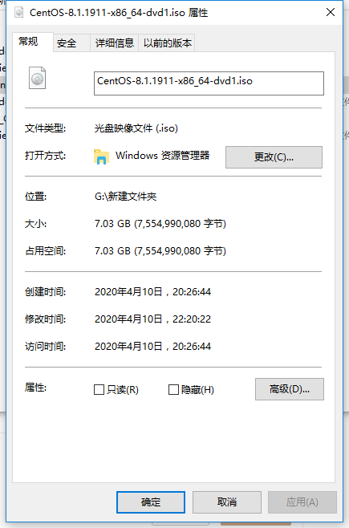
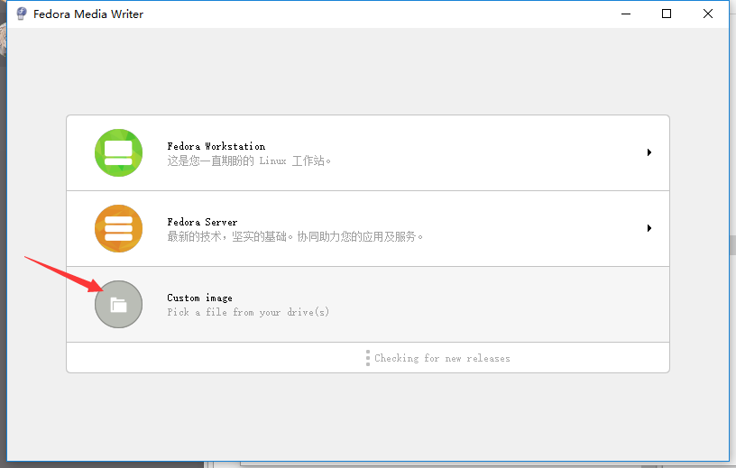

# 硬盘安装linux教程

首先，我安装的是centos，首先先要去官网看一下，直接从官网下载。
注意，官网使用的是分流，所以国内的从阿里云的镜像源下载就挺好。
[官网下载地址](http://isoredirect.centos.org/centos/8/isos/x86_64/CentOS-8.1.1911-x86_64-dvd1.iso)

下载好iso文件后，大概是这样样子：

因为我电脑两张硬盘，一张128固态，一战张256固态，256的固态用来安装了windows10（因为基本不玩电脑游戏，存储资料有额外的移动硬盘）。因此我准备吧centos安装在128g的固态上。

想安装这个iso文件用普通的启动盘是不行的，需要直接把iso写进u盘。
使用`FedoraMediaWriter`这个软件就很好用，百度上资源很多，直接下载就行了。

解压启动之后，选择这一项：

然后选择你的u盘和要写的iso文件，注意别选错了。

写好之后，拔掉就行了，接下来关机，进入bios，选择从u盘启动，就可以正常进入centos安装了。这部分网上教程多的是，大家自己百度一下就好了。

注意，这个u盘制作成启动盘后，就不能再存储数据了。插到电脑上，资源管理器也识别不出来。这个和普通的启动盘倒是不一样。装好之后，还是用`FedoraMediaWriter`，可以恢复成普通的u盘。

注意备份资料！！！！